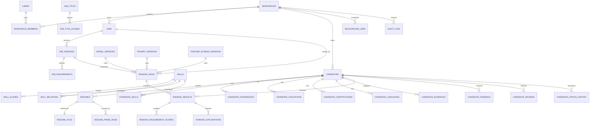

# Data Model

## Entity relationship diagram

## Table inventory

| Area | Tables |
|---|---|
| Identity | `users`, `workspaces`, `workspace_members`, `refresh_tokens` |
| Jobs | `jobs`, `job_versions`, `job_requirements` |
| Resumes | `candidates`, `resumes`, `resume_files`, `resume_parse_runs` |
| Profile | `candidate_skills`, `candidate_experiences`, `candidate_educations`, `candidate_certifications`, `candidate_languages`, `candidate_evidences` |
| Taxonomy | `skills`, `skill_aliases`, `skill_relations`, `job_titles`, `job_title_aliases` |
| Ranking | `ranking_runs`, `ranking_results`, `ranking_requirement_scores`, `ranking_explanations` |
| Human review | `candidate_feedback`, `candidate_reviews`, `candidate_status_history` |
| Governance | `model_versions`, `prompt_versions`, `feature_schema_versions` |
| Platform | `background_jobs`, `audit_logs` |

## Data invariants

- Tenant-owned tables contain `workspace_id`, and repository methods require it.
- Primary identifiers are UUIDs generated by the application/database.
- Main mutable tables contain `created_at`, `updated_at`, and `created_by`.
- Soft deletion uses `deleted_at`; audit and immutable result tables are not
  silently deleted.
- A `job_version` is immutable after a ranking run references it.
- A `ranking_run` stores requirement and weight snapshots as JSONB in addition
  to normalized result rows.
- `(workspace_id, checksum, parser_version)` prevents duplicate parse work.
- Evidence records preserve page, offsets, method, confidence, parser/model,
  and prompt provenance.
- Candidate PII is stored separately from the generated blind profile used by
  search and ranking.
- `ranking_results` are append-only. A job edit creates a new job version and
  ranking run.

## Index strategy

- B-tree composite indexes begin with `workspace_id` for all tenant queries.
- Add `(workspace_id, job_id, status)` and
  `(workspace_id, candidate_id, created_at DESC)` for common views.
- Use a GIN `to_tsvector` index over blind searchable profile text.
- Use a pgvector HNSW cosine index for blind profile embeddings.
- Use unique lower-case indexes for skill/job title normalized names.
- Use partial indexes for active rows and pending background jobs.
- Evaluate time or workspace partitioning after measured table growth; do not
  partition prematurely.

