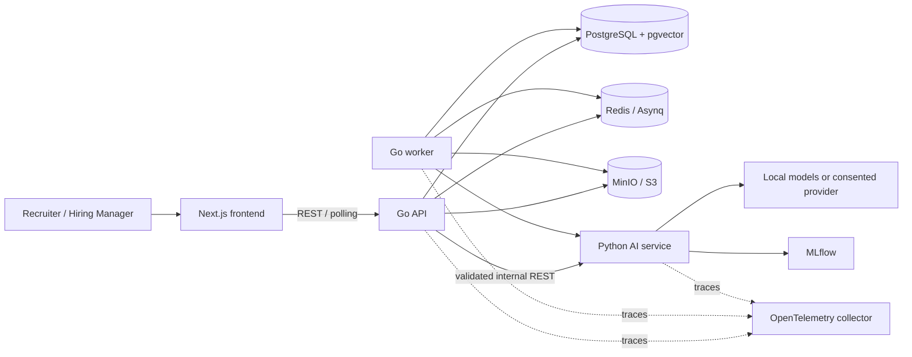
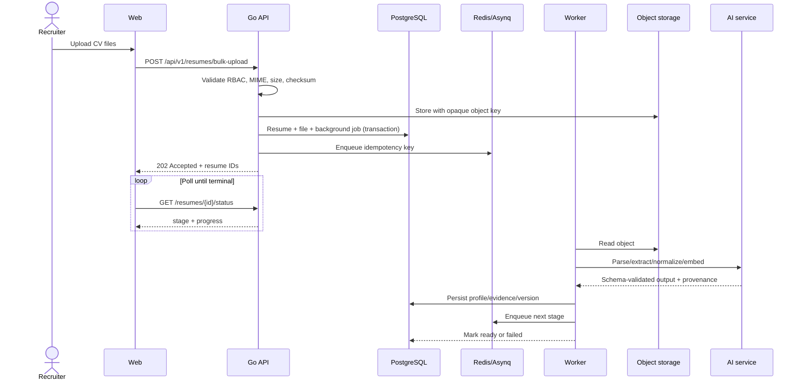
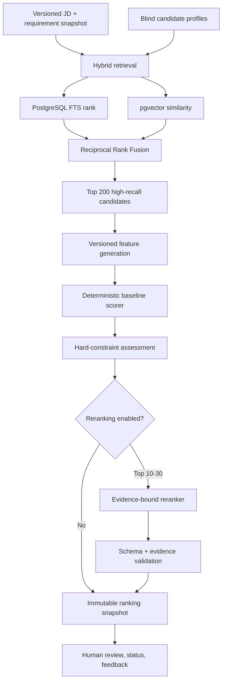

# System Architecture

## Technology choices

| Concern | Choice | Reason |
|---|---|---|
| API and worker | Go 1.24, Chi | Small surface area, explicit middleware, efficient concurrent APIs and workers |
| AI pipeline | Python 3.12, FastAPI, Pydantic | Strong document/ML ecosystem and strict output validation |
| Web app | Next.js App Router, TypeScript, Tailwind | Typed B2B UI with server/client rendering and accessible composition |
| Primary data | PostgreSQL 17 + pgvector | Transactions, tenant-safe relational data, full-text and vector retrieval in one system |
| Queue/cache | Redis + Asynq | Reliable Go background processing with retry and uniqueness support |
| Object store | S3 abstraction, MinIO locally | Expiring signed URLs and production-compatible local development |
| Model registry | MLflow | Model/experiment metadata without coupling ranking to a provider |
| Schema evolution | Goose SQL migrations | Reviewable up/down SQL and deterministic startup |
| Observability | OpenTelemetry + structured JSON logs | Cross-service correlation without a vendor dependency |
| Contracts | OpenAPI 3.1 | Generated clients and machine-checkable API compatibility |

The MVP uses a deterministic rule-based ranker. Provider interfaces permit
later embeddings, LambdaMART, cross-encoder, or LLM re-ranking without changing
the ranking-run domain model.

## Runtime architecture



The Go application is a modular monolith: authentication, jobs, candidates,
resumes, ranking, search, feedback, taxonomy, and audit are modules in one
deployable API/worker codebase. Modules interact through application
interfaces, not cross-module table writes. The AI service is separate because
its dependency and scaling profile differs materially.

## Request and document flow



Queue publishing uses a transactional outbox-compatible `background_jobs`
record. Phase 1 exposes the lifecycle and health checks; the dispatcher is
implemented with the resume workflow in Phase 4.

## Ranking pipeline



Protected attributes, name, contact data, photo, date of birth, and exact home
address are removed before retrieval and feature generation. A hard-constraint
failure is surfaced as evidence for review; it does not trigger automatic
rejection.

The baseline score is:

```text
must_have * 0.35
+ relevant_experience * 0.20
+ nice_to_have * 0.15
+ seniority * 0.10
+ domain * 0.10
+ education * 0.05
+ recency * 0.05
```

Weights are copied into each ranking run. Every result records feature schema,
model, prompt, and requirement snapshot versions.

## Monorepo structure

```text
.
├── backend/
│   ├── cmd/api/                 # HTTP process
│   ├── cmd/worker/              # Asynq consumers
│   ├── internal/                # domain/application/adapter modules
│   ├── migrations/              # reviewable Goose up/down migrations
│   └── tests/
├── ai-service/
│   ├── app/                     # FastAPI and pipeline modules
│   ├── prompts/                 # immutable prompt versions
│   ├── scripts/
│   └── tests/
├── frontend/
│   ├── app/                     # App Router routes
│   ├── components/
│   ├── features/
│   ├── lib/
│   └── tests/
├── docs/
│   ├── adr/
│   ├── api/
│   └── architecture/
├── infra/
│   └── otel/
├── scripts/
├── .github/workflows/
├── compose.yaml
└── Makefile
```

## AI and platform abstractions

```go
type DocumentParser interface {
    Parse(context.Context, ParseRequest) (ParsedDocument, error)
}
type ObjectStorage interface {
    Put(context.Context, PutObject) (ObjectRef, error)
    SignedGetURL(context.Context, ObjectRef, time.Duration) (string, error)
}
type EmbeddingProvider interface {
    Embed(context.Context, []EmbeddingInput) ([]Embedding, error)
}
type Ranker interface {
    Rank(context.Context, RankingInput) (RankingOutput, error)
}
type LLMProvider interface {
    StructuredOutput(context.Context, LLMRequest, any) (LLMUsage, error)
}
```

Provider configuration is workspace-scoped. An external call is rejected unless
that workspace has explicit consent and the data minimization policy permits it.

## Scale path

- Partition tenant-heavy tables by workspace or creation month when required.
- Use pgvector HNSW and filtered workspace/job indexes before adding OpenSearch.
- Separate workers by queue and autoscale expensive parsing/ranking workloads.
- Store original documents in object storage, not database rows.
- Cache immutable parse outputs by checksum + parser version.
- Split a module into a service only after ownership, load, or release cadence
  creates a measured need.

